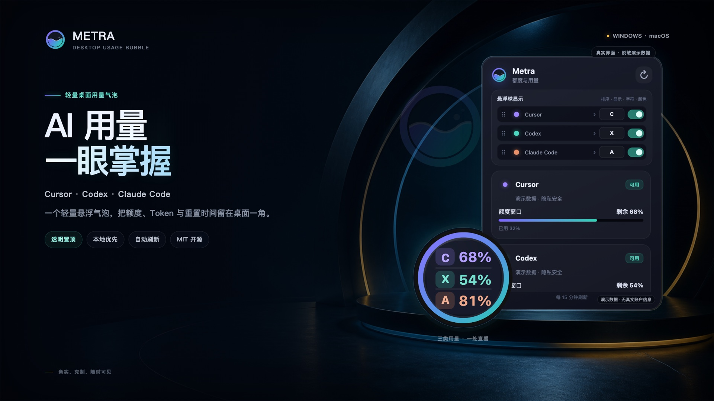

# Metra

[English](README.md) · **简体中文** · [日本語](README.ja.md) · [한국어](README.ko.md)

Metra 是一个轻量的跨平台桌面气泡，用来查看 Cursor、Codex 和 Claude Code 的登录状态、额度、重置时间、token 与可用费用信息。

## 功能

- Windows / macOS 透明置顶气泡，支持自由拖动和多显示器；屏幕边缘吸附可在右键菜单中开启，默认关闭。
- 开启自动吸边后，首次拖到屏幕边缘并松手就会立即缩成 32 px 半隐藏状态，这次拖动后无需等待闲置；移入、聚焦或点击会立即完整显示，唤醒后的普通再次半隐藏仍保留闲置延时。
- 自动发现本机 `cursor-agent` / `agent`、`codex` 与 `claude` CLI。
- Codex 使用官方 App Server 获取多额度窗口和 token 汇总。
- Cursor 未登录时可直接进入官方登录流程；该动作不会隐式开启兼容模式，也不会自动安装 CLI。登录后，用户仍需单独确认才会开启个人兼容模式读取精确用量。Ultra 会分别展示 Cursor Models、Other Models、Grok Bot 周额度和 On-Demand 四部分；Team 等旧套餐继续使用原有金额布局。
- Claude Code 通过 `claude auth status --json` 检测登录；可用时只读汇总本地会话中的 token 数字。使用 Anthropic API Key 登录时，组织管理员可以显式配置 Admin API Key，以获取所选密钥主体在 UTC 当日的官方 token 用量和预估费用。API Key 或自定义网关不提供剩余额度时，界面会如实显示“暂无额度”，不会伪造百分比。
- 悬浮球中的三个 Provider 支持独立开关显示、通过六点图标拖动排序，显示字符和标记颜色也可分别自定义；内置 55 色快捷色板，配置保存在 SQLite。
- 左键展开详情，并通过弹窗中的刷新图标更新用量；右键菜单顶部直接提供语言下拉框，同时可设置刷新间隔、开机启动、兼容模式、重新检测或退出，不再重复放置“立即更新”。
- 刷新失败保留最后一次成功数据，并明确标记为过期。
- 界面支持简体中文（`zh-CN`）、English、日本語与한국어；“自动检测”会跟随操作系统 / 浏览器语言，手动选择后立即生效并在重启后保留。

<p align="center">
  <a href="docs/assets/readme/metra-readme-hero.png">
    
  </a>
</p>

## 开发

需要 Rust stable、Node.js 22.13+、npm 或 pnpm，以及 Tauri 对应平台的系统依赖。

```text
npm install
npm run check
npm run verify:i18n
npm test
npm run dev
```

发布构建：

```text
npm run build
```

在 Windows 上，请先完全退出所有正在运行的 Metra 实例，再从仓库根目录打开 PowerShell 并执行。检测到 Metra 仍在运行时，脚本会给出明确提示并停止，避免产物文件被占用：

```powershell
npm install --global pnpm@11.22.0
pnpm install --frozen-lockfile
pnpm run build:portable
```

项目已在 `package.json` 中锁定 `pnpm@11.22.0`，第一条命令会直接安装这个版本，不依赖 Corepack。仓库中的 `pnpm-workspace.yaml` 已显式包含根包，避免 pnpm 报出 `packages field missing or empty`。项目级 Cargo 配置也禁用了用户级 rustc wrapper，因此不会再调用全局 `sccache`。便携版产物位于 `src-tauri/target/release/Metra-<version>-portable.exe`。如需生成 Windows 安装包，请改用 `pnpm run build`，产物位于 `src-tauri/target/release/bundle`。

构建 macOS 通用包请使用专用命令：

```text
pnpm run build:macos-universal
# 或
npm run build:macos-universal
```

该命令会将 Cargo 和 rustc 固定到同一个 rustup `stable` 工具链，安装两个 macOS targets，禁用 `sccache`，再调用 Tauri 构建 `universal-apple-darwin`。手动运行 `pnpm run build -- --target universal-apple-darwin` 会多传一个 `--`；它可能进入 Cargo/rustc，导致 universal target 被当作 Rust target specification 解析。Homebrew Rust 遮蔽 rustup、造成 Cargo 与 rustc 来自不同工具链时也会构建失败。专用命令会同时规避这两个问题。

## 可选：官方 Claude Code API 用量

Anthropic 的 Claude Code Analytics API 仅接受组织级 Admin API Key（`sk-ant-admin...`）。普通 Claude API Key（`sk-ant-api...`）无法查询历史用量，个人账户也无法使用 Admin API。详见 [Claude Code Analytics API 文档](https://platform.claude.com/docs/en/manage-claude/claude-code-analytics-api)。

请在启动 Metra 的进程环境中设置以下变量：

```text
ANTHROPIC_ADMIN_KEY=sk-ant-admin...
METRA_CLAUDE_API_KEY_NAME=Claude Code Key
```

`METRA_CLAUDE_API_KEY_NAME` 必须与 Anthropic Console 中的 API Key 名称一致。当每日报告只有一个 API Key 主体时可以省略；出现多个主体时则必须设置。Claude Code Analytics 返回的是密钥名称而非密钥 ID，因此请确保该名称在组织内唯一。如果名称存在歧义，Metra 会拒绝显示结果，避免混入其他密钥的用量。更改任一环境变量后，请重启 Metra。

API 按 UTC 自然日汇总用量，数据可能有最长约一小时的延迟，且返回的是 token 和预估费用，而不是 Pro / Max 剩余百分比。Admin API Key 具有组织级权限：仅应在可信设备上通过操作系统环境或密钥管理器注入，并定期轮换。Metra 不提供任何明文持久化这些密钥的机制。

## 数据与隐私

- SQLite 配置只保存刷新周期、界面语言偏好、气泡完整位置、自动吸边开关、Provider 顺序与显隐、字符与颜色、自启动和兼容模式授权状态；临时半隐藏坐标不会持久化。
- Codex 凭据由已安装的 Codex CLI/App Server 管理，Metra 不直接读取或保存。
- Cursor 个人兼容模式默认关闭。开启后只读查询 Cursor 的 `state.vscdb`，令牌仅存在于单次请求内存中并在使用后清除。
- Cursor 网络请求只允许 HTTPS 的 `api2.cursor.sh` 和 `cursor.com`，禁止跨域重定向。
- Claude Code 采集只调用登录状态命令，并从 `~/.claude/projects` 的 JSONL 中反序列化时间戳、消息 ID 和 usage 数字；不读取消息正文、API Key 或 Base URL。
- `ANTHROPIC_ADMIN_KEY` 只会在 Rust 进程内短暂使用，不会写入 SQLite、发送到 WebView、记入日志，也不会传给 Metra 启动的任何子进程。官方请求固定发往 `https://api.anthropic.com` 并禁止重定向；响应中的用户主体信息会被忽略，仅缓存所选 API Key 的汇总数字。
- 应用不记录邮箱、令牌、会话正文或完整接口响应。

## 发布签名

推送 `v*` 标签会触发发布产物工作流。正式发布 macOS 版本时，发布环境必须提供 `APPLE_CERTIFICATE`、`APPLE_CERTIFICATE_PASSWORD`、`APPLE_ID`、`APPLE_PASSWORD` 和 `APPLE_TEAM_ID`。

工作流会强制校验 macOS 产物：必须同时包含 `arm64` 与 `x86_64` 的 Universal 二进制，使用 `Developer ID Application` 签名，带有 hardened runtime 标记，通过 Gatekeeper 检查，并且 `.app` 与 `.dmg` 的 notarization ticket 都能通过验证；否则直接失败。

本地 ad-hoc macOS 构建仍然适合做架构和打包自检，但只可用于测试，不适合公开发布。

## License

MIT
